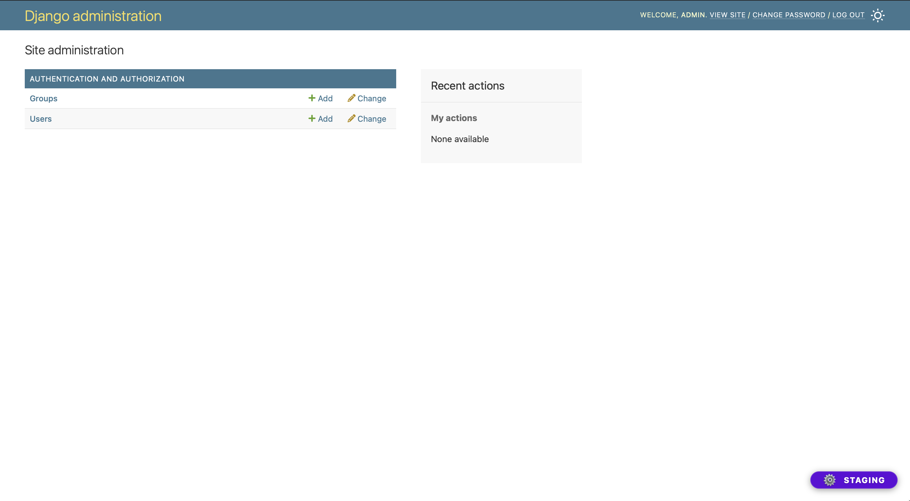
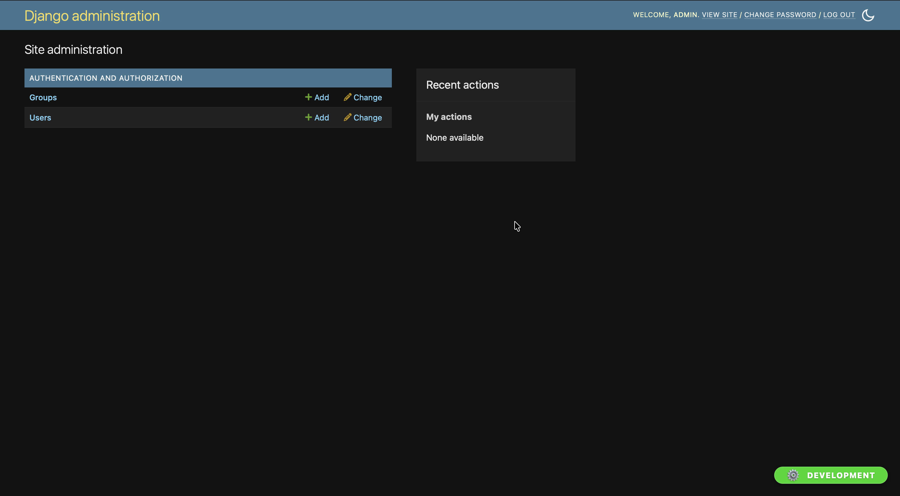
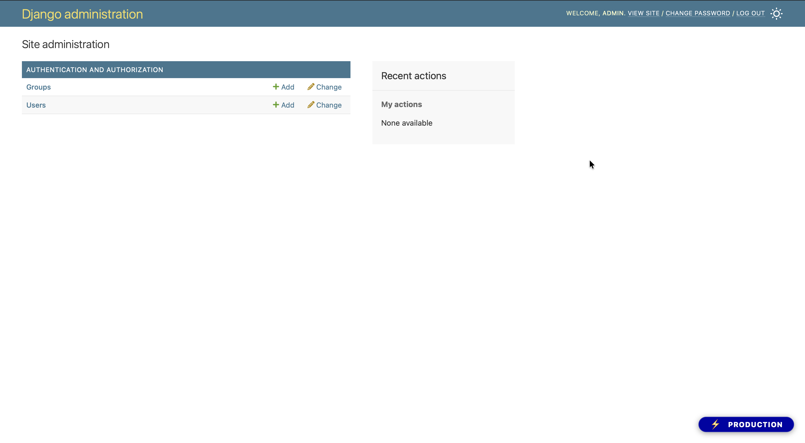

# django-admin-env-badge

A simple Django app that displays an environment badge in the Django admin — so you always know whether you're on Production, Staging, or Development.

## Screenshots

**Staging** (light mode)



**Development** (dark mode)



**Production** (light mode)



## Installation

```bash
pip install django-admin-env-badge
```

## Setup

### 1. Add the app to `INSTALLED_APPS`

Place it **before** `django.contrib.admin`:

```python
INSTALLED_APPS = [
    "django_admin_env_badge",
    "django.contrib.admin",
    # ...
]
```

### 2. Add the context processor

```python
TEMPLATES = [
    {
        "BACKEND": "django.template.backends.django.DjangoTemplates",
        "OPTIONS": {
            "context_processors": [
                # ... default processors
                "django_admin_env_badge.context_processors.env_badge",
            ],
        },
    },
]
```

## Configuration

Add these settings to your `settings.py`:

| Setting | Type | Default | Description |
|---------|------|---------|-------------|
| `ADMIN_ENV_NAME` | `str` | `None` | The environment name to display. Badge is hidden when not set. |
| `ADMIN_ENV_COLOR` | `str` | `"#22FE00"` | Badge background color (any valid CSS color). |
| `ADMIN_ENV_ICON` | `str` | `""` | Optional emoji shown before the name. ⚙️, 🚀, 🛠️|

## Example

```python
# settings.py

ADMIN_ENV_NAME = "Production"
ADMIN_ENV_COLOR = "#0003a6"
ADMIN_ENV_ICON = "⚡"
```


